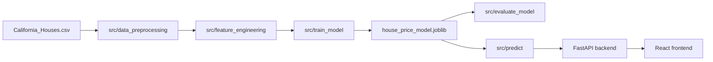

# Architecture

The project is a local machine-learning pipeline plus a small inference stack: Python modules train and score a regressor; FastAPI loads the saved artifact; a React form collects 13 features and displays the predicted median house value.



## Machine learning pipeline

All modules live under [src/](../src/) and are designed to run from the repository root (`python -m src.<module>`).

| Module | Role |
|---|---|
| [data_preprocessing.py](../src/data_preprocessing.py) | Load `data/raw/California_Houses.csv`, separate `Median_House_Value`, 80/20 split with `random_state=42` |
| [feature_engineering.py](../src/feature_engineering.py) | Select and order the 13 numeric columns the model expects |
| [eda.py](../src/eda.py) | Dataset summary and EDA plots under `outputs/plots/` |
| [train_model.py](../src/train_model.py) | Fit `RandomForestRegressor(n_estimators=200, random_state=42, n_jobs=-1)` and save joblib |
| [evaluate_model.py](../src/evaluate_model.py) | Reload the artifact, score the test set, write `outputs/metrics.csv` |
| [predict.py](../src/predict.py) | Load the artifact and predict a single house from a feature dict |

Feature engineering does not add derived columns. Distances to the coast and major cities are already in the CSV. `engineer_features` only validates that required columns exist and returns them in a fixed order so training and serving stay aligned.

The notebook [house_price_prediction.ipynb](../notebook/house_price_prediction.ipynb) is the research path: it trains Linear Regression (scaled) and Random Forest on the same split, plots residuals, writes sample predictions, and saves the production artifact.

## Backend (FastAPI)

[backend/main.py](../backend/main.py) exposes:

| Method | Path | Purpose |
|---|---|---|
| `GET` | `/` | Status message |
| `GET` | `/health` | Health check |
| `POST` | `/predict` | Median house value from 13 features |

`POST /predict` accepts a JSON body matching Pydantic `HouseFeatures` (the same 13 names as `FEATURE_COLUMNS`). The handler calls `src.predict.predict_house_price` and returns:

```json
{
  "predicted_house_value": 123456.78,
  "currency": "USD"
}
```

CORS allows all origins so the Vite dev server can call the API. The frontend is hardcoded to `http://127.0.0.1:8000`.

Run uvicorn from the **repository root** so `from src.predict import ...` resolves:

```bash
uvicorn backend.main:app --reload --host 127.0.0.1 --port 8000
```

## Frontend (React + Vite)

[frontend/src/App.jsx](../frontend/src/App.jsx) is a single-page valuation form:

- Property fields (income, age, rooms, bedrooms, population, households)
- Location fields (latitude, longitude, five distance features)
- Client-side validation (required numbers, geographic ranges, rooms ≥ bedrooms, population ≥ households)
- `fetch` to `http://127.0.0.1:8000/predict`
- Result panel with the estimated value and the production metrics (R² 0.8250, MAE $30,407)

Default Vite port is **5173**. API port is **8000**.

## Tests

[pytest.ini](../pytest.ini) sets `pythonpath = .` so imports like `from src.predict import load_model` work without installing the package. Tests live in [tests/](../tests/) and cover preprocessing, features, EDA plot writers, training, evaluation, and prediction.

Prediction tests require `outputs/house_price_model.joblib`. Preprocessing and EDA tests require `data/raw/California_Houses.csv`.
