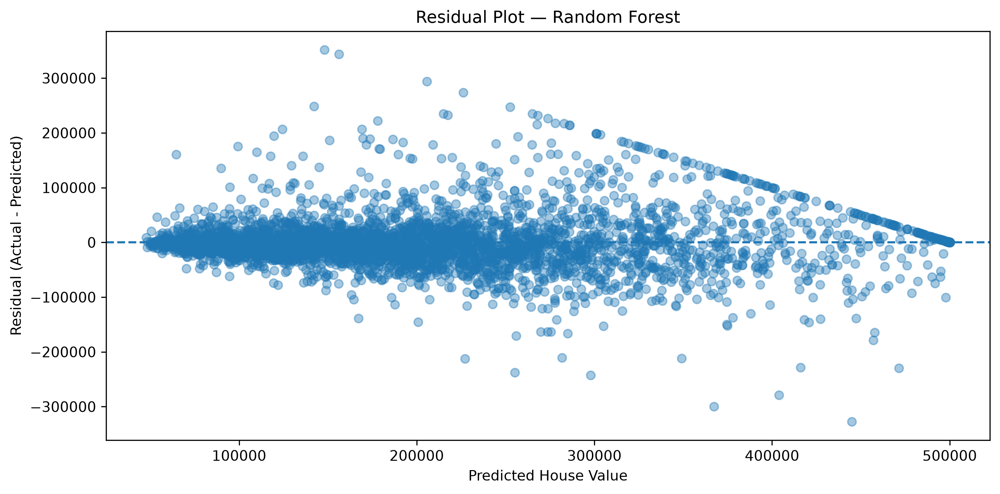

# Evaluation summary

Random Forest is the production model. Linear Regression is the assignment baseline, trained in the notebook on the same 80/20 split (`random_state=42`, 4,128 test rows).

## Test-set metrics

| Model | MAE | RMSE | R² |
|---|---|---|---|
| Linear Regression | $50,404.86 | $69,353.01 | 0.6330 |
| Random Forest (200 trees) | $30,407.79 | $47,883.47 | 0.8250 |

Production numbers are stored in [outputs/metrics.csv](../outputs/metrics.csv) by [src/evaluate_model.py](../src/evaluate_model.py). The notebook also writes a two-row comparison table (Linear Regression + Random Forest).

### What the metrics mean

- **MAE** — average absolute dollar error on the test set. Lower is better.
- **RMSE** — square root of mean squared error; penalizes large misses more than MAE. Lower is better.
- **R²** — fraction of test-set variance in `Median_House_Value` explained by the model. 1.0 is a perfect fit.

RMSE is larger than MAE for both models, which is expected when some block groups have large residuals (including the well-known $500,001 cap on median value in this dataset).

## Why Random Forest is the saved artifact

On this test set, Random Forest cuts MAE by about $20k and RMSE by about $21.5k relative to Linear Regression, and raises R² from 0.63 to 0.83. House value vs income, location, and distances is nonlinear; an ensemble of 200 trees captures those interactions without a scaled linear assumption. The API and UI therefore load `outputs/house_price_model.joblib` from [src/train_model.py](../src/train_model.py).

## Residual plot

File: [outputs/plots/random_forest_residuals.png](../outputs/plots/random_forest_residuals.png)

Residuals are `actual − predicted` on the test set, plotted against predicted value. A well-behaved model clusters around the horizontal zero line. Spread increases at higher predicted values, which is typical for this housing table (heteroscedasticity and the upper cap). Linear Regression residuals are plotted in the notebook under the title “Residual Plot — Linear Regression”.

## Sample predictions vs actual (five rows)

From [outputs/sample_predictions.csv](../outputs/sample_predictions.csv):

| Actual house value | Predicted house value | Absolute error |
|---|---|---|
| $47,700.00 | $51,389.50 | $3,689.50 |
| $45,800.00 | $79,838.00 | $34,038.00 |
| $500,001.00 | $476,089.46 | $23,911.54 |
| $218,600.00 | $239,704.50 | $21,104.50 |
| $278,000.00 | $275,394.54 | $2,605.46 |

These are Random Forest test-set examples written from the notebook. They satisfy the requirement of at least five predicted-vs-actual pairs.

## Other plots

| Plot | Path |
|---|---|
| Target distribution | [outputs/plots/target_distribution.png](../outputs/plots/target_distribution.png) |
| Feature correlation heatmap | [outputs/plots/correlation_heatmap.png](../outputs/plots/correlation_heatmap.png) |
| Median income vs house value | [outputs/plots/income_vs_house_value.png](../outputs/plots/income_vs_house_value.png) |
| Distance to coast vs house value | [outputs/plots/coast_distance_vs_house_value.png](../outputs/plots/coast_distance_vs_house_value.png) |
| Random Forest feature importance | [outputs/plots/feature_importance.png](../outputs/plots/feature_importance.png) |
| Random Forest residuals | [outputs/plots/random_forest_residuals.png](../outputs/plots/random_forest_residuals.png) |

EDA plots are regenerated with `python -m src.eda`. Residual and importance plots are produced in the notebook.

## Disclaimer

Predictions are 1990 census median values, not current market prices.
